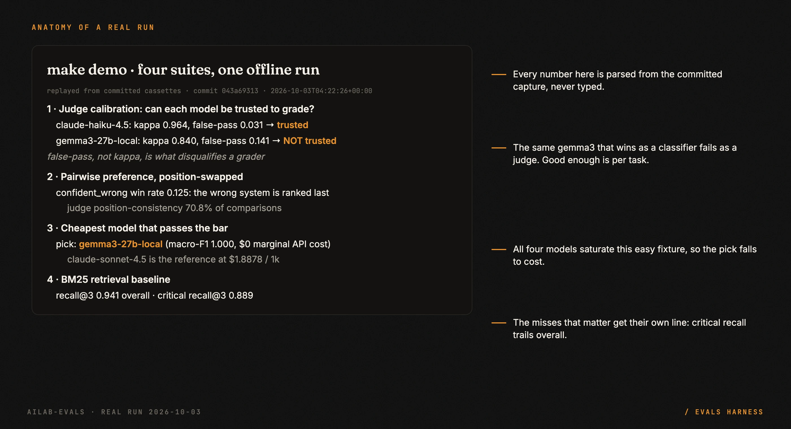
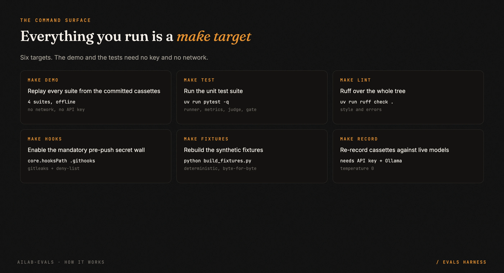
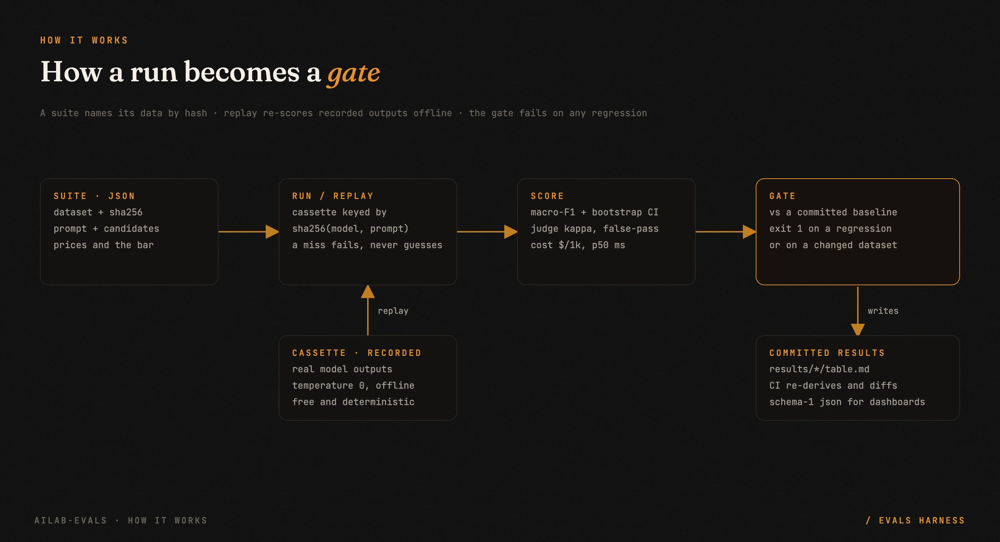

<p align="center">
  
</p>

<p align="center">
  
  
  
  
</p>

# An evals harness for LLM decisions

Most model comparisons end with a chart and a vibe. This one ends with a verdict you can defend:
**which is the cheapest model that is good enough?** It answers that question from a fixed, hashed,
labeled dataset against a bar written down before the run, and it refuses to give a number when the
data cannot support one.

- **Four suites, one offline run.** Classifier bake-off, LLM-as-judge calibration, position-swapped
  pairwise preference, and a BM25 retrieval baseline. `make demo` replays all four with no network
  and no API key.
- **Every result names its data.** Datasets are JSONL hashed with sha256, so a result can never
  drift from the rows it measured. Errors are scored as wrong, never skipped.
- **Judges are measured before they are trusted.** An LLM judge is calibrated against gold labels;
  false-pass and false-fail are reported separately, and a lenient judge is disqualified whatever its
  kappa says.
- **Zero runtime dependencies.** Stdlib only, so a host application can pin it by commit SHA with no
  lock-file conflict. The provider client, the keys and the spend caps stay in the host.

> **The one idea worth stealing, even if you never run this code:** write the pass bar down before
> the run, and make it relative to a reference you already trust. "Within 3 macro-F1 points of the
> current production model, and above the random baseline" is a bar you can defend. "F1 at least
> 0.85" just invites an argument about the number after you see the results.

---

## 60 seconds to a verdict

```bash
uv sync
make demo        # replays every suite from the committed cassettes: no network, no API key
make test
```

`make demo` prints four tables. The classifier suite ends with the pick:

```
| candidate | n | accuracy | macro-F1 | 95% CI | ECE | error rate | $ / 1k | p50 ms | bar |
|---|---:|---:|---:|---|---:|---:|---:|---:|---|
| majority | 40 | 0.500 | 0.333 | [0.26, 0.39] | 0.500 | 0.000 | 0.0000 | 0 | baseline |
| random | 40 | 0.575 | 0.575 | [0.42, 0.72] | 0.075 | 0.000 | 0.0000 | 0 | baseline |
| gemma3-27b-local | 40 | 1.000 | 1.000 | [1.00, 1.00] | 0.053 | 0.000 | 0.0000 | 4942 | PASS, cheapest passing |
| claude-sonnet-4.5 | 40 | 1.000 | 1.000 | [1.00, 1.00] | 0.035 | 0.000 | 1.8878 | 3055 | reference |

Cheapest model that passes the bar: gemma3-27b-local.
```

Full output, with every number parsed straight from the committed `make demo` capture:

<p align="center"></p>

Every command is a `make` target. The demo and the tests need no key and no network.

<p align="center"></p>

## Results on the public fixtures

Recorded 2026-10-01 against real models at temperature 0, replayed and re-verified in CI on every
push. The fixtures are synthetic and labeled by construction (see [`FIXTURES.md`](FIXTURES.md)), so
read them as a demonstration of the harness, not a leaderboard. Costs use list prices. `-local`
models ran on local hardware via Ollama, so their API cost is $0 while compute is not free.

### 1. Judge calibration: can each model be trusted to grade answers?
112 graded answers (16 questions by 7 answer kinds; 64 of them deliberately wrong).

| judge | n | agreement | Cohen's κ | false-pass | false-fail | trusted |
|---|---:|---:|---:|---:|---:|---|
| claude-sonnet-4.5 | 112 | 0.973 | 0.946 | 0.047 | 0.000 | yes |
| claude-haiku-4.5 | 112 | 0.982 | 0.964 | 0.031 | 0.000 | yes |
| qwen3-32b-local | 112 | 0.964 | 0.927 | 0.047 | 0.021 | yes |
| gemma3-27b-local | 112 | 0.920 | 0.840 | 0.141 | 0.000 | **NO** |

**What it shows:**
- The easy answer kinds were graded perfectly by every judge: paraphrases, wrong numbers, wrong entities, evasions.
- **Every judge error landed on the two trap kinds**, and 17 of 18 errors on the same one: a *correct answer that
  also carries one false side claim* ("32 degrees F, which equals 10 degrees C"). Judges tend to pass an answer once
  its headline is right.
- gemma3-27b passed 9 of 16 such answers. Its κ of 0.84 looks respectable. Its 14% false-pass rate is what
  disqualifies it as a grader, which is why the harness reports false-pass on its own line.

### 2. Pairwise preference: position-swapped, with claude-haiku-4.5 as judge
Each pair is judged twice, with A/B swapped. A winner has to win in both orders, otherwise the pair counts as a tie.

| system | games | wins | losses | ties | win rate | Bradley-Terry |
|---|---:|---:|---:|---:|---:|---:|
| detailed | 32 | 17 | 0 | 15 | 0.766 | 1159.7 |
| concise | 32 | 14 | 7 | 11 | 0.609 | 1068.7 |
| confident_wrong | 32 | 0 | 24 | 8 | 0.125 | 771.7 |

- The wrong system never wins.
- The judge was position-consistent on **70.8%** of comparisons. Without the swap, roughly 3 in 10 verdicts would
  have reflected answer order rather than content.
- Haiku also prefers the longer of two equally correct answers (`detailed` over `concise`): verbosity bias, now
  measured.

### 3. Cheapest model that passes: binary "does this page have substance?" classification
The bar is written before the run: macro-F1 no more than 3 points below the reference (Sonnet), **and** its lower 95%
CI above the `random` baseline's upper CI. A bar defined only relative to a reference is only as strong as that
reference. There are 40 scored rows, and 20 more held out for calibration.

| candidate | n | accuracy | macro-F1 | 95% CI | ECE | error rate | $ / 1k | p50 ms | bar |
|---|---:|---:|---:|---|---:|---:|---:|---:|---|
| majority | 40 | 0.500 | 0.333 | [0.26, 0.39] | 0.500 | 0.000 | 0.0000 | 0 | baseline |
| random | 40 | 0.575 | 0.575 | [0.42, 0.72] | 0.075 | 0.000 | 0.0000 | 0 | baseline |
| gemma3-27b-local | 40 | 1.000 | 1.000 | [1.00, 1.00] | 0.053 | 0.000 | 0.0000 | 4942 | **PASS** cheapest passing |
| qwen3-32b-local | 40 | 1.000 | 1.000 | [1.00, 1.00] | 0.060 | 0.000 | 0.0000 | 3617 | **PASS** |
| claude-haiku-4.5 | 40 | 1.000 | 1.000 | [1.00, 1.00] | 0.039 | 0.000 | 0.7701 | 1571 | **PASS** |
| claude-sonnet-4.5 | 40 | 1.000 | 1.000 | [1.00, 1.00] | 0.035 | 0.000 | 1.8878 | 3055 | reference |

**Cheapest model that passes the bar: `gemma3-27b-local`.**

Honest reading:
- This fixture is **too easy to separate the models**. All four saturate it, so selection falls to cost. What it
  demonstrates is the mechanism: the baselines, the bar relative to a reference, the cost column, and the named
  pick.
- The same model that wins as a *classifier* here fails as a *judge* in table 1. "Good enough" is per task, which
  is the reason to measure each one.

### 4. Retrieval baseline: BM25 over a 20-document runbook corpus

| retriever | n | recall@3 | hit@3 | MRR | nDCG@3 | critical recall@3 |
|---|---:|---:|---:|---:|---:|---:|
| bm25 | 17 | 0.941 | 1.000 | 1.000 | 0.954 | 0.889 |

Recall on the `critical` subset trails overall recall, so the misses that matter are reported on their own line.

## Wire it to your real data

Record against live models (needs `ANTHROPIC_API_KEY` and/or a local Ollama):

```bash
uv run ailab-evals run suites/substance.json --mode record
```

Gate a change against a stored baseline (exits 1 on a regression or a changed dataset):

```bash
uv run ailab-evals gate new/claude-haiku-4.5.json results/substance/claude-haiku-4.5.json \
  --tolerances suites/tolerances.json
```

Use it as a library with your own data and model client:

```python
from ailab_evals.datasets import Dataset
from ailab_evals.gate import cheapest_passing
from ailab_evals.runner import FunctionCandidate, ScoringConfig, run
from ailab_evals.types import Prediction

ds = Dataset.load_jsonl("my_labeled_set.jsonl")
cfg = ScoringConfig(labels=["yes", "no"], floor_per_class=10, calibrate_split="calibrate")
results = [run(ds, FunctionCandidate(name, fn), config=cfg) for name, fn in my_candidates.items()]
pick = cheapest_passing(results, {"macro_f1": {"min_vs_reference": -0.03}}, reference="current-model")
print(pick.winner)
```

A suite is a JSON file that names the dataset, the prompt, the candidates with their prices, and the
bar. See [`suites/`](suites/) for the four bundled suites and [`docs/DESIGN.md`](docs/DESIGN.md) for
the tradeoffs behind each choice.

## How it works

<p align="center"></p>

1. **Suite.** A JSON file names the dataset (and its sha256), the prompt, each candidate with its
   list price, and the bar to clear. The dataset hash travels with every result.
2. **Run or replay.** Each candidate predicts every row. Replay serves model calls from a cassette
   keyed on `sha256(provider, model, params, system, prompt)`, so a prompt edit is a cache miss, not
   a silent reuse of stale output. A miss fails the run; a model error is scored as wrong.
3. **Score.** Macro-F1 with bootstrap confidence intervals, per-class floors that print
   `INSUFFICIENT` below them, ECE, Platt scaling fitted only on a held-out split, judge kappa with
   false-pass and false-fail split apart, cost per 1k, and latency.
4. **Gate.** `ailab-evals gate` compares a fresh run to a committed baseline and exits 1 on a
   regression or a changed dataset. It is the same replay CI runs on every push.

The harness reads data and prices; it never calls a model on its own and never holds a key. Your
provider callable, your keys and your spend caps live in your code and are passed in.

## Scope: what it does not do

- **Not a leaderboard.** The bundled fixtures are synthetic and labeled by construction, so they are
  deliberately easy and several models saturate them. They exercise the harness; they do not rank
  models in the wild.
- **Not a production monitor.** Offline evals compare candidates on a fixed labeled set before a
  change. Watching live traffic for drift after a change is a separate job.
- **No data adapters.** This public repo holds the interface and synthetic fixtures only. The reader
  that scores your real, private data lives in your application, never here.
- **Confidence is self-reported.** ECE measures how honest a model's stated confidence is; it is not
  a logprob and not a property of the underlying distribution.

## The patterns

| Pattern | The failure it prevents |
|---|---|
| Hash the dataset into every result | a result that silently measured different rows than you think |
| Score errors as wrong, never skip | a model rewarded for failing on exactly the hard items |
| Calibrate a judge before trusting it | a lenient grader that passes bad output in a quality gate |
| Report false-pass on its own line | a high false-pass rate hidden behind a respectable kappa |
| Position-swap every pairwise verdict | a win rate that reflects answer order, not answer content |
| Write the bar down before the run | a threshold quietly chosen after the results look good |
| Bar relative to a trusted reference | an absolute number nobody agreed to, argued about forever |
| Record then replay in CI | an eval too slow or too costly to gate on, so nobody gates |

Each one, with the tradeoff behind it: [`docs/DESIGN.md`](docs/DESIGN.md). The concepts, with ten
interview questions and short answers: [`docs/LEARNING.md`](docs/LEARNING.md).

## FAQ

**Why macro-F1 instead of accuracy?** Accuracy lets a model win on an imbalanced set by ignoring the
minority class. Macro-F1 weights every class equally, which is why a majority baseline sits in every
table next to it.

**How do you know an LLM judge is any good?** Calibrate it against labels whose correctness is known:
agreement, Cohen's kappa, and false-pass and false-fail separately. It is not trusted as a gate until
it clears a preset kappa and a preset false-pass ceiling.

**What is position bias and how is it controlled?** A pairwise judge tends to favour the answer it
sees first. Each pair is judged twice with A/B swapped; a winner has to win both orders, otherwise it
is a tie. The position-consistency rate is reported as a judge-quality signal.

**Does it need an LLM or a GPU?** No. The core is plain Python with zero runtime dependencies. `make
demo` replays recorded outputs and runs fully offline. Live recording is optional.

**Where do the numbers come from?** Models you already use, through a provider callable you pass in.
The bundled results were recorded against Claude (Anthropic API) and two local Ollama models; see
[`MODEL_CARD.md`](MODEL_CARD.md).

## Privacy wall

This repo holds an interface and synthetic fixtures only. Every push runs:
- **gitleaks** over the full history, both as a pre-push hook (`make hooks`) and as a required CI job;
- a **deny-list**: private terms stored as sha256 hashes, plus private-network, secret-token and email patterns.

Applications keep their data adapters in their own codebases.

## Roadmap

- More retrieval baselines next to BM25, so a dense retriever has something to beat.
- A harder public fixture with borderline items, so the classifier suite can separate models instead
  of saturating.
- Per-suite history, so a gate can show the trend, not just the latest pass or fail.

## License

MIT. Copyright 2026 Andrew Pyle. See [`LICENSE`](LICENSE).
